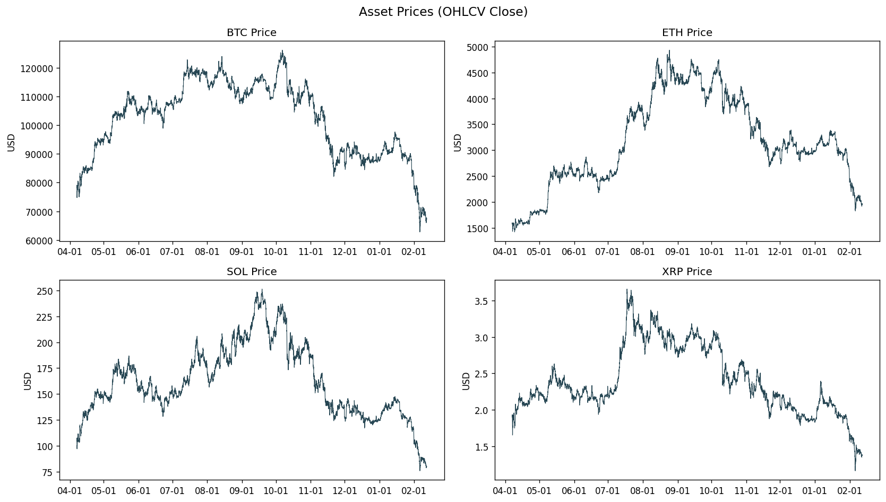
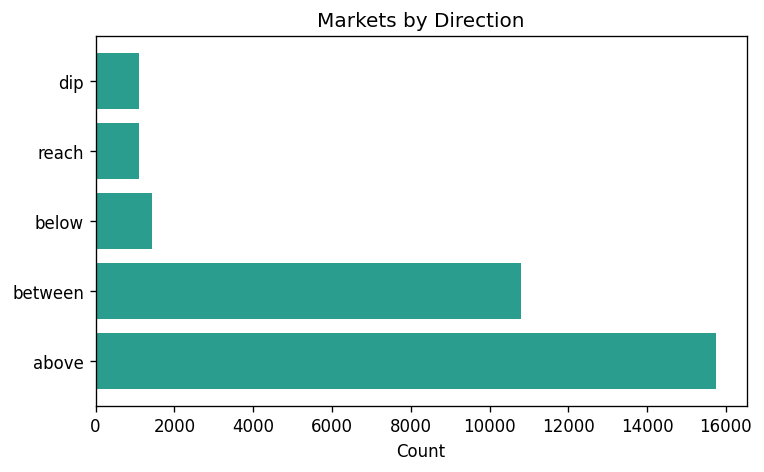
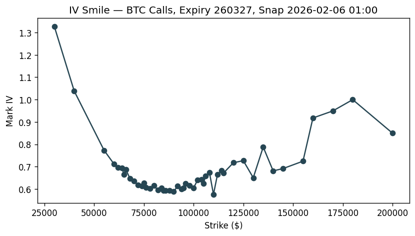
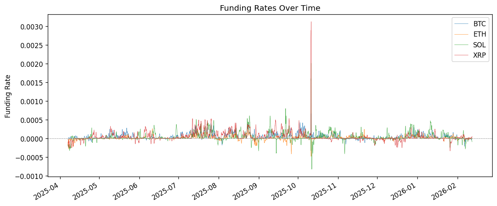
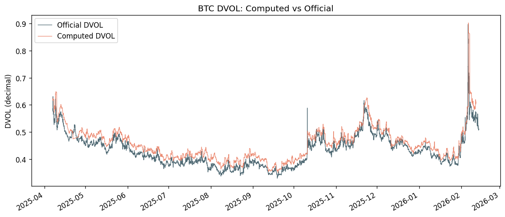
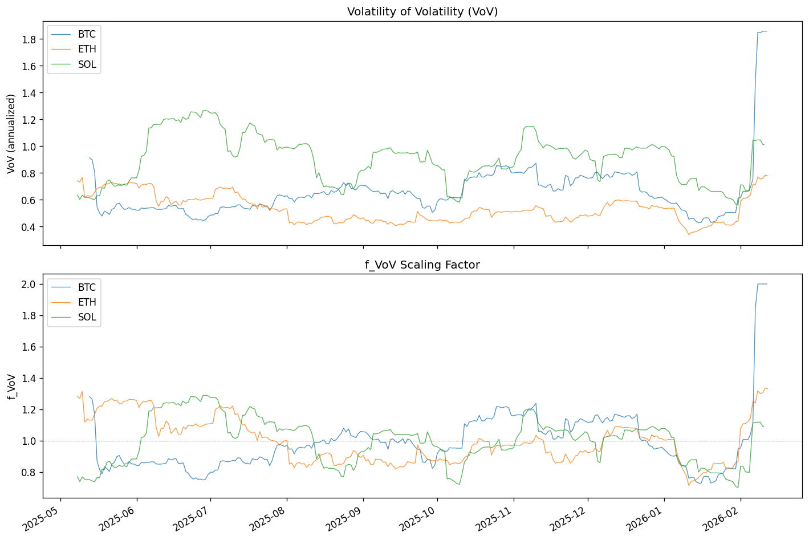
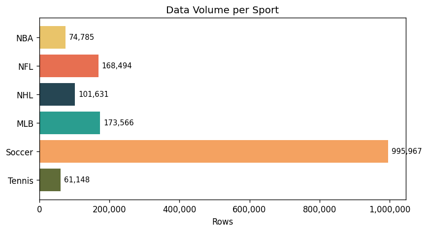
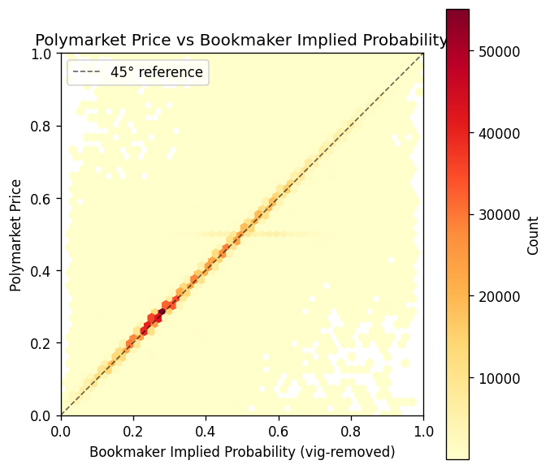
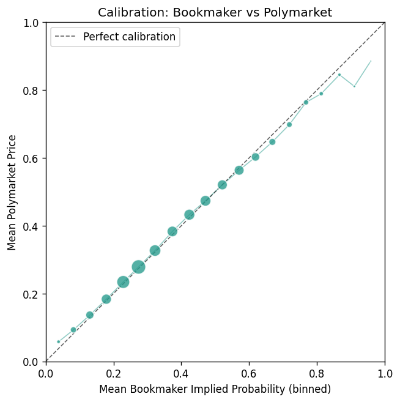

# Taut-Arb-Backtest

- Backtesting data for crypto prediction market arbitrage — compares Polymarket prices against model-derived probabilities from Deribit derivatives data.
- Backtesting data for sports bets on Polymarket — compares de-vigged odds from sharp bookmaker Pinnacle

## Overview

Polymarket lists thousands of prediction markets on crypto price events ("Will BTC be above $100k on Jan 1?"). Each market trades at a price between 0 and 1 that reflects the crowd's implied probability. This system independently prices those same events using options, futures, and funding rate data from Deribit, then identifies mispricings and simulates trading them.

**Assets:** BTC, ETH, SOL, XRP
**Coverage:** April 2025 – February 2026
**Markets:** 30,180 settled prediction markets with 1.1M price observations

## Architecture

```
┌─────────────────────────────────────────────────────────────┐
│  1. COLLECTION         Async collectors (6 APIs, no auth)   │
│     Polymarket CLOB ─── market discovery + price history    │
│     Polymarket Gamma ── active markets                      │
│     Goldsky GraphQL ─── price backfill for gaps             │
│     Deribit History ─── options trades, futures, OHLCV      │
│     Deribit Main ────── funding rates, DVOL index           │
├─────────────────────────────────────────────────────────────┤
│  2. STORAGE            SQLite (10 raw tables → 9 snapshot   │
│                        tables in sample DB)                 │
├─────────────────────────────────────────────────────────────┤
│  3. ANALYSIS           IV surface reconstruction            │
│                        Forward curve interpolation           │
│                        Rogers-Satchell realized volatility   │
│                        Funding rate drift estimation         │
│                        DVOL computation (Carr-Madan)         │
│                        Volatility-of-volatility (VoV)        │
├─────────────────────────────────────────────────────────────┤
│  4. BACKTEST           Model probability vs market price    │
│                        Edge calculation + PnL simulation    │
└─────────────────────────────────────────────────────────────┘
```

## Data Sources

| Source           | Endpoint                   | Data                                                |
| ---------------- | -------------------------- | --------------------------------------------------- |
| Polymarket CLOB  | `clob.polymarket.com`      | Market discovery, price history (cursor pagination) |
| Polymarket Gamma | `gamma-api.polymarket.com` | Active markets (offset pagination)                  |
| Goldsky GraphQL  | `api.goldsky.com`          | Price backfill for ~30-50% of settled markets       |
| Deribit History  | `history.deribit.com`      | Options trades with IV, dated futures, 1h OHLCV     |
| Deribit Main     | `www.deribit.com`          | 8-hour perpetual funding rates, DVOL index          |

No API keys required — all endpoints are public.

## Dataset

Pre-collected databases covering April 2025 – February 2026 are available as a [GitHub Release](https://github.com/ADnocap/taut-arb-backtest/releases/tag/v2.0-data):

| File                    | Contents                                                    | Raw Size | Download                                                                                                   |
| ----------------------- | ----------------------------------------------------------- | -------- | ---------------------------------------------------------------------------------------------------------- |
| `backtest_data.db.gz`   | Raw trade-level data (10 tables, ~12M rows)                 | 2.4 GB   | [Download](https://github.com/ADnocap/taut-arb-backtest/releases/download/v2.0-data/backtest_data.db.gz)   |
| `backtest_sample.db.gz` | Hourly snapshots for backtesting (9 tables, incl. DVOL/VoV) | 1.5 GB   | [Download](https://github.com/ADnocap/taut-arb-backtest/releases/download/v2.0-data/backtest_sample.db.gz) |

To decompress:

```bash
gunzip backtest_data.db.gz                  # → backtest_data.db (project root)
gunzip backtest_sample.db.gz                # → move to sample/backtest_sample.db
```

## Sample Data

The `sample/` directory contains a pre-built SQLite database with hourly snapshots and diagnostic charts. See [`sample/DATA_GUIDE.md`](sample/DATA_GUIDE.md) for full schema documentation and query examples.

### Asset Prices (OHLCV)



### 30,180 Markets by Direction Type



### IV Smile — BTC Calls



### Funding Rates



### DVOL — Computed vs Official (BTC)



### Volatility-of-Volatility (VoV)



## Sports Dataset

Polymarket prediction prices vs vig-removed sportsbook implied probabilities across 6 sports — moneyline (match-winner) markets only.

**Sports:** NBA, NFL, NHL, MLB, Soccer, Tennis
**Coverage:** March 2023 -- February 2026
**Events:** 5,171 matched events, 1.58M price observations

Pre-built datasets are available as a [GitHub Release](https://github.com/ADnocap/taut-arb-backtest/releases/tag/v3.0-sports):

| File                    | Contents                                                | Download                                                                                                     |
| ----------------------- | ------------------------------------------------------- | ------------------------------------------------------------------------------------------------------------ |
| `sports_data.db.gz`     | SQLite database (5 tables, raw prices + odds + matches) | [Download](https://github.com/ADnocap/taut-arb-backtest/releases/download/v3.0-sports/sports_data.db.gz)     |
| `sports_dataset.csv.gz` | Final aligned CSV (1.58M rows, 6 columns)               | [Download](https://github.com/ADnocap/taut-arb-backtest/releases/download/v3.0-sports/sports_dataset.csv.gz) |

See [`sports/README.md`](sports/README.md) for full documentation — schema, vig-removal math, matching methodology, and query examples.

### Data Volume per Sport



### Polymarket Price vs Bookmaker Implied Probability



### Calibration Curve



## Quick Start

```bash
pip install -r requirements.txt

# Collect Polymarket markets for BTC
python collect.py --assets BTC --step 1

# Collect price histories
python collect.py --assets BTC --step 2

# Collect Deribit options, futures, funding, OHLCV, DVOL (steps 3–7)
python collect.py --assets BTC --step 3
python collect.py --assets BTC --step 4
python collect.py --assets BTC --step 5
python collect.py --assets BTC --step 6
python collect.py --assets BTC --step 7

# Validate collected data
python validate.py

# Build sample database with charts
python build_sample.py
```

Collection is idempotent — safe to re-run. Each step resumes from the last saved timestamp.

## Project Structure

```
config.py                       Asset configs, API URLs, constants
database.py                     SQLite schema, batch inserts, resume helpers
classifier.py                   Market classification regex
collect.py                      CLI orchestrator (--assets, --step)
validate.py                     Data quality report (Rich tables)
build_sample.py                 Build sample DB + charts from raw data
dvol_compute.py                 VIX-style DVOL from options (Black-76 + Carr-Madan)
vov.py                          Volatility-of-volatility computation
collectors/
  base.py                       BaseCollector with retry/backoff/semaphore
  polymarket_markets.py         CLOB + Gamma market discovery
  polymarket_prices.py          CLOB price history + Goldsky backfill
  deribit_options.py            Options trades (day-by-day, IV normalization)
  deribit_futures.py            Dated futures (perpetuals filtered)
  deribit_funding.py            Funding rates (30-day chunks)
  deribit_ohlcv.py              1h OHLCV candles (30-day chunks)
  deribit_dvol.py               DVOL volatility index candles (hourly)
sample/
  DATA_GUIDE.md                 Full schema docs + query examples
  *.png                         Diagnostic charts
sports/
  README.md                     Sports dataset documentation + math
  config.py                     Sport definitions, team aliases, constants
  database.py                   SQLite schema (5 tables), query helpers
  matcher.py                    Cross-reference Polymarket ↔ Odds API events
  build_dataset.py              CLI orchestrator + CSV export + charts
  collectors/
    polymarket_markets.py       Gamma series-based market discovery
    polymarket_prices.py        Goldsky + CLOB 15-min price history
    odds_api.py                 The Odds API historical h2h odds
  charts/                       Diagnostic charts (8 PNGs)
```
