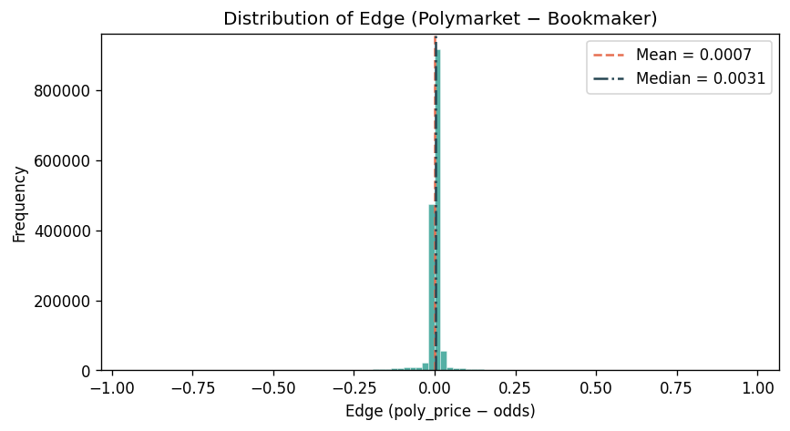
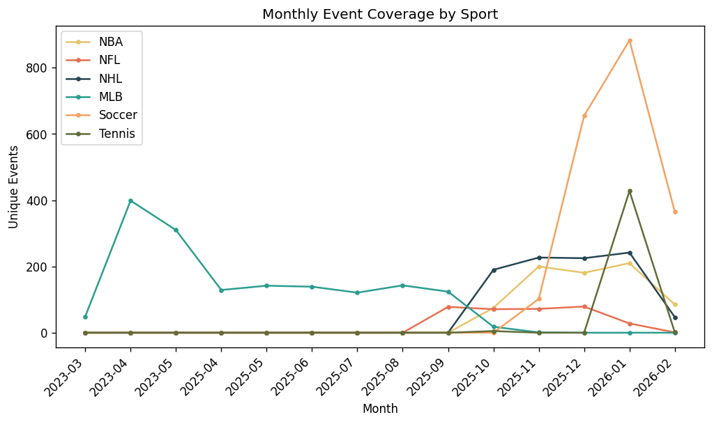
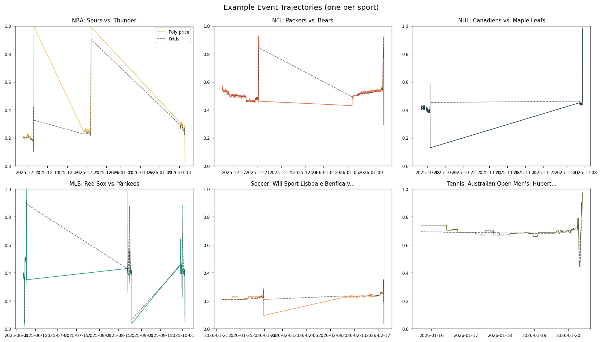
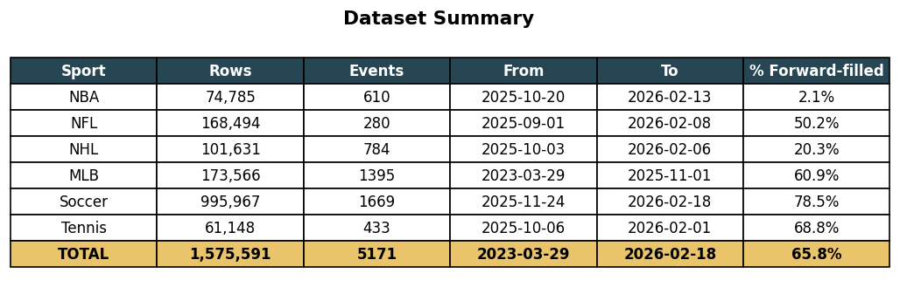

# Sports Prediction Dataset

Polymarket prediction prices vs vig-removed sportsbook implied probabilities across 6 sports.

**1.58M rows | 6 sports | 5,171 events | March 2023 -- February 2026**

---

## CSV Format

File: `sports_dataset.csv`

| Column           | Type         | Description                                               |
| ---------------- | ------------ | --------------------------------------------------------- |
| `datetime`       | ISO 8601 UTC | Observation timestamp (15-minute grid)                    |
| `event_name`     | string       | `"{Sport}: {question or team matchup}"`                   |
| `poly_price`     | float [0, 1] | Polymarket price for team A / YES outcome                 |
| `poly_price_b`   | float [0, 1] | Polymarket price for team B / NO outcome                  |
| `odds`           | float [0, 1] | Vig-removed bookmaker implied probability                 |
| `forward_filled` | 0 or 1       | 1 if this row was forward-filled from a prior observation |

### Row Counts by Sport

| Sport     |          Rows |    Events | Date Range             |
| --------- | ------------: | --------: | ---------------------- |
| NBA       |        74,785 |       610 | 2025-10 -- 2026-02     |
| NFL       |       168,494 |       280 | 2025-09 -- 2026-02     |
| NHL       |       101,631 |       784 | 2025-10 -- 2026-02     |
| MLB       |       173,566 |     1,395 | 2023-03 -- 2025-11     |
| Soccer    |       995,967 |     1,669 | 2025-11 -- 2026-02     |
| Tennis    |        61,148 |       433 | 2025-10 -- 2026-02     |
| **Total** | **1,575,591** | **5,171** | **2023-03 -- 2026-02** |

---

## Pipeline Overview

```
Step 1: Discover markets ──── Gamma API (/events?series_id=X)
        │                     Filter: sportsMarketType == "moneyline"
        ▼
Step 2: Price histories ───── Goldsky GraphQL (primary) + CLOB API (fallback)
        │                     15-minute bucketed candles
        ▼
Step 3: Sportsbook odds ──── The Odds API (/historical/sports/{key}/odds)
        │                     h2h market, multiple bookmakers per snapshot
        ▼
Step 4: Match events ─────── Cross-reference Polymarket ↔ Odds API
        │                     Date proximity (±1 day) + team name matching
        ▼
Step 5: Generate CSV ─────── Align prices with nearest odds (±15 min)
        │                     Vig removal + forward-fill on 15-min grid
        ▼
Step 6: Generate charts ──── 8 diagnostic PNGs in sports/charts/
```

### Data Sources

| Source           | Endpoint                   | Auth    | Data                            |
| ---------------- | -------------------------- | ------- | ------------------------------- |
| Polymarket Gamma | `gamma-api.polymarket.com` | None    | Market discovery (series-based) |
| Goldsky GraphQL  | `api.goldsky.com`          | None    | 15-min price candles (primary)  |
| Polymarket CLOB  | `clob.polymarket.com`      | None    | Price history fallback          |
| The Odds API     | `api.the-odds-api.com/v4`  | API key | Historical h2h odds snapshots   |

---

## Vig Removal

Sportsbook odds include a "vig" (vigorish / overround) -- the booksum exceeds 1. We remove this before comparing to Polymarket prices.
**IMPORTANT NOTE: The vig is only removed in the CSV. The odds column in sports_dataset.csv is the vig-removed implied probability.
The .db file stores raw decimal odds (home_odds, away_odds, draw_odds in the odds_snapshots table) straight from the bookmakers — vig still baked in.**

### Binary Markets (n = 2) -- Additive Method

For a two-outcome market with decimal odds $o_1, o_2$:

**Raw implied probabilities:**

$$\hat{p}_i = \frac{1}{o_i}$$

**Booksum (overround):**

$$B = \sum_{i=1}^{n} \hat{p}_i > 1$$

**Devigged probabilities (additive / equal-margin):**

$$p_i = \hat{p}_i - \frac{B - 1}{n}$$

This is equivalent to the Shin model for $n = 2$: the margin is split equally between outcomes, producing identical results to the Shin insider-trading adjustment when there are exactly two outcomes.

**Fallback:** If any $p_i \leq 0$ after additive adjustment, fall back to multiplicative normalization:

$$p_i = \frac{\hat{p}_i}{B}$$

### Three-Way Markets (n = 3) -- Power Method

For soccer (home / away / draw), the power method preserves the favourite-longshot relationship:

**Objective:** Find $k > 1$ such that:

$$\sum_{i=1}^{n} \hat{p}_i^k = 1$$

**Devigged probabilities:**

$$p_i = \hat{p}_i^k$$

The function $f(k) = \sum \hat{p}_i^k$ is strictly decreasing on $[1, \infty)$ with $f(1) = B > 1$ and $f(\infty) \to 0$, so a unique root $k^*$ is guaranteed. We solve via Brent's method on $[1, 100]$ (`scipy.optimize.brentq`).

**Fallback:** If Brent fails to converge, fall back to multiplicative normalization.

---

## Event Matching

Each Polymarket market is matched to an Odds API event through a multi-stage process:

### 1. Date Proximity

Events must occur within **1 calendar day** of each other. The comparison uses:

- `game_start_time` (unix timestamp) if available from Polymarket
- `game_date` (string YYYY-MM-DD) as fallback, compared to `commence_time` from Odds API

### 2. Team Name Normalization

Each sport maintains an alias dictionary mapping common abbreviations and nicknames to canonical names:

```
"celtics" → "Boston Celtics"
"man utd" → "Manchester United"
"niners"  → "San Francisco 49ers"
```

### 3. Fuzzy Matching

After normalization, team names are compared using `difflib.SequenceMatcher`. A match requires a score $\geq 0.75$. Both team mappings are tested (poly_A=home vs poly_A=away) and the higher-scoring assignment is used.

### 4. Tennis: Last-Name Matching

Individual sports use last-name extraction: "Djokovic" matches "Novak Djokovic" with score 1.0. Substring containment scores 0.95.

### 5. Soccer: Question Parsing

Soccer markets on Polymarket are phrased as questions:

- `"Will Arsenal win on 2025-01-15?"` → win market, single-team match
- `"Will Arsenal vs. Chelsea end in a draw?"` → draw market, two-team match

Regex patterns extract team names and market type (win vs draw), then matching proceeds as above.

---

## Database Schema

File: `sports_data.db` (SQLite)

### sports_markets

| Column            | Type        | Description                     |
| ----------------- | ----------- | ------------------------------- |
| `id`              | INTEGER PK  | Auto-increment                  |
| `condition_id`    | TEXT UNIQUE | Polymarket condition identifier |
| `sport`           | TEXT        | Sport name (NBA, NFL, etc.)     |
| `question`        | TEXT        | Market question text            |
| `team_a`          | TEXT        | First team / outcome            |
| `team_b`          | TEXT        | Second team / outcome           |
| `game_date`       | TEXT        | Game date (YYYY-MM-DD)          |
| `game_start_time` | INTEGER     | Unix timestamp of game start    |
| `token_a_id`      | TEXT        | CLOB token ID for team A        |
| `token_b_id`      | TEXT        | CLOB token ID for team B        |
| `winner`          | TEXT        | Winning team (if settled)       |
| `outcome`         | TEXT        | Market outcome                  |

### sports_price_history

| Column         | Type       | Description                     |
| -------------- | ---------- | ------------------------------- |
| `id`           | INTEGER PK | Auto-increment                  |
| `condition_id` | TEXT       | FK to sports_markets            |
| `timestamp`    | INTEGER    | Unix timestamp (15-min buckets) |
| `team_a_price` | REAL       | Price for team A [0, 1]         |
| `team_b_price` | REAL       | Price for team B [0, 1]         |
| `source`       | TEXT       | `'goldsky'` or `'clob'`         |
|                |            | UNIQUE(condition_id, timestamp) |

### odds_snapshots

| Column          | Type       | Description                                   |
| --------------- | ---------- | --------------------------------------------- |
| `id`            | INTEGER PK | Auto-increment                                |
| `odds_event_id` | TEXT       | Odds API event identifier                     |
| `sport`         | TEXT       | Sport name                                    |
| `home_team`     | TEXT       | Home team name                                |
| `away_team`     | TEXT       | Away team name                                |
| `commence_time` | INTEGER    | Event start time (unix)                       |
| `snapshot_ts`   | INTEGER    | Odds snapshot timestamp                       |
| `home_odds`     | REAL       | Decimal odds for home team                    |
| `away_odds`     | REAL       | Decimal odds for away team                    |
| `draw_odds`     | REAL       | Decimal odds for draw (soccer only)           |
| `bookmaker`     | TEXT       | Bookmaker name                                |
|                 |            | UNIQUE(odds_event_id, snapshot_ts, bookmaker) |

### matched_events

| Column                | Type        | Description                       |
| --------------------- | ----------- | --------------------------------- |
| `id`                  | INTEGER PK  | Auto-increment                    |
| `condition_id`        | TEXT UNIQUE | FK to sports_markets              |
| `odds_event_id`       | TEXT        | FK to odds_snapshots              |
| `poly_team_a_is_home` | INTEGER     | 1 if poly team_a is the home team |
| `match_score`         | REAL        | Fuzzy match confidence [0, 1]     |

### credits_log

| Column         | Type       | Description                 |
| -------------- | ---------- | --------------------------- |
| `id`           | INTEGER PK | Auto-increment              |
| `timestamp`    | INTEGER    | When the API call was made  |
| `sport`        | TEXT       | Sport name                  |
| `sport_key`    | TEXT       | Odds API sport key          |
| `date_str`     | TEXT       | Date queried                |
| `credits_used` | INTEGER    | Credits consumed            |
|                |            | UNIQUE(sport_key, date_str) |

---

## Charts

All charts are generated in `sports/charts/`:

| Chart             | File                       | Description                                                         |
| ----------------- | -------------------------- | ------------------------------------------------------------------- |
| Data Volume       | `rows_per_sport.png`       | Horizontal bar chart of rows per sport                              |
| Event Count       | `events_per_sport.png`     | Vertical bar chart of unique events per sport                       |
| Price vs Odds     | `poly_vs_odds_scatter.png` | Hexbin scatter of Polymarket price vs bookmaker implied probability |
| Edge Distribution | `edge_distribution.png`    | Histogram of (poly_price - odds) with mean/median                   |
| Coverage          | `coverage_over_time.png`   | Monthly unique events per sport                                     |
| Trajectories      | `event_trajectories.png`   | Example event: poly_price + odds over time (one per sport)          |
| Calibration       | `calibration_curve.png`    | Binned odds vs mean poly_price with 45 degree reference             |
| Summary           | `data_summary.png`         | Per-sport statistics table                                          |

### Data Volume per Sport


### Polymarket Price vs Bookmaker Implied Probability


### Calibration Curve


### Edge Distribution



### Monthly Coverage



### Event Trajectories



### Dataset Summary



---

## Usage Examples

### Load CSV with pandas

```python
import pandas as pd

df = pd.read_csv("sports_dataset.csv", parse_dates=["datetime"])
df["sport"] = df["event_name"].str.split(":").str[0]

# Filter to NBA, non-forward-filled rows
nba = df[(df["sport"] == "NBA") & (df["forward_filled"] == 0)]

# Compute edge
nba["edge"] = nba["poly_price"] - nba["odds"]
print(nba["edge"].describe())
```

### Query sports_data.db

```sql
-- Events per sport
SELECT sport, COUNT(*) FROM sports_markets GROUP BY sport;

-- Average match score
SELECT sport, AVG(match_score) as avg_score, COUNT(*) as n
FROM matched_events me
JOIN sports_markets sm ON me.condition_id = sm.condition_id
GROUP BY sport;

-- Price history for a specific event
SELECT sph.timestamp, sph.team_a_price, sph.team_b_price
FROM sports_price_history sph
JOIN sports_markets sm ON sph.condition_id = sm.condition_id
WHERE sm.question LIKE '%Lakers%'
ORDER BY sph.timestamp;
```

---

## Quick Start

```bash
pip install -r requirements.txt

# Step 1: Discover Polymarket sports markets
python -m sports.build_dataset --all --step 1

# Step 2: Collect price histories
python -m sports.build_dataset --all --step 2

# Step 3: Collect Odds API historical odds (requires ODDS_API_KEY in .env)
python -m sports.build_dataset --all --step 3

# Step 4: Cross-reference events
python -m sports.build_dataset --all --step 4

# Step 5: Generate CSV dataset
python -m sports.build_dataset --all --step 5

# Step 6: Generate charts
python -m sports.build_dataset --all --step 6

# Or run all steps at once
python -m sports.build_dataset --all
```

Each step is idempotent and resumes from the last checkpoint.
